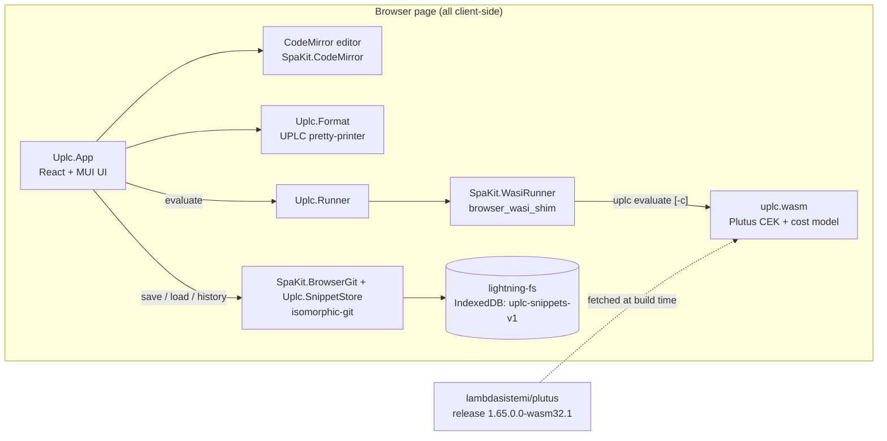

# Plutus Browser

Browser UI for the wasm32 Plutus evaluator: UPLC playground with editor,
evaluator output, and browser-local versioned snippets.

Live app: <https://lambdasistemi.github.io/plutus-browser/>

## What is this

Plutus Browser is a single-page application that evaluates Untyped Plutus
Core (UPLC) programs entirely in the browser. It embeds `uplc.wasm` — the
real Plutus CEK machine and cost model compiled to wasm32-wasi from the
32-bit-correct fork [lambdasistemi/plutus](https://github.com/lambdasistemi/plutus)
(release [1.65.0.0-wasm32.1](https://github.com/lambdasistemi/plutus/releases/tag/1.65.0.0-wasm32.1)) —
so evaluation results match the 64-bit chain byte for byte. No server is
involved: the wasm binary is bundled into the page and runs through a WASI
shim.

The UI is written in PureScript (react-basic + MUI, CodeMirror editor). It
ships 22 bundled example programs and lets you keep your own snippets, which
are versioned in a browser-local git repository (isomorphic-git over
lightning-fs, persisted in IndexedDB) — every edit is auto-committed, and
each snippet's history can be viewed and restored.

## Architecture



- `src/Main.purs` mounts the React app; `src/Uplc/App.purs` is the whole UI
  (drawer with snippets, examples and history; editor; controls; output).
- `src/Uplc/Runner.purs` compiles the bundled wasm module and runs it as a
  CLI: `uplc evaluate`, plus `-c` when the budget toggle is on.
- `src/Uplc/Examples.purs` is **generated** from `examples/*.uplc` by
  `scripts/generate-examples.mjs` — edit the `.uplc` files, not the module.
- `src/bootstrap.js` is the esbuild entry that inlines `src/assets/uplc.wasm`
  as bytes and exposes them to the PureScript side.
- Snippets live in a git repository at `/repo` inside a lightning-fs
  filesystem named `uplc-snippets-v1`; saves, renames and deletes are git
  commits (`src/Uplc/SnippetStore.*`).

## Install

There is nothing to install for normal use — open the
[live app](https://lambdasistemi.github.io/plutus-browser/).

To build the static site yourself (output is plain HTML + JS, host anywhere):

```sh
nix build
# result/ contains index.html and index.js
```

## Quickstart

```sh
nix develop
just install   # npm ci
just bundle    # downloads uplc.wasm, builds dist/
just serve     # http://127.0.0.1:4173/
```

Open the URL, pick an example (e.g. `01-add-integers`) and press
**Evaluate** — the output panel shows `(con integer 42)`.

## Usage

Everything happens in the single page:

- **Editor** — CodeMirror with a UPLC pretty-printer. **Format** re-indents
  the program (2/4/8 spaces, selectable); *auto format* formats on blur.
- **Evaluate** — runs the program through the wasm CEK. *auto evaluate*
  re-runs after each edit (default debounce 350 ms, configurable). The
  *show budget (-c)* toggle adds CPU and memory budget figures to the output.
- **Snippets** — *Quick add snippet* creates an empty named snippet;
  *new from...* creates one from a copy of an existing snippet, a local
  file, or a URL. Rename and delete from each row's hover actions.
- **Auto-versioning** — edits to a snippet are auto-committed (default
  debounce 1500 ms). The **History** panel lists commits; selecting one
  shows that version read-only, and **Restore version** commits it back.
- **Examples** — bundled programs, editable in place (the row shows
  *edited example*), but edits are not persisted until you press **Save as
  my snippet**. Examples cover integer/bytestring
  builtins, if-then-else, lambdas, recursion via fixpoint, lists,
  constr/case, and tracing/error.

Snippets are stored only in your browser (IndexedDB); clearing site data
deletes them.

## Documentation

- For AI agents, start at [AGENTS.md](AGENTS.md).
- Evaluator provenance and releases: [lambdasistemi/plutus](https://github.com/lambdasistemi/plutus).

## Development

```sh
nix develop            # purs, spago, esbuild, node 22, just, purs-tidy, chromium
just build             # regenerate examples module + spago build
just dev               # spago build --watch
just fmt               # purs-tidy format-in-place
just ci                # install + lint + build + bundle + test
```

Tests are a Playwright suite (`test/uplc.spec.mjs`) that serves `dist/` and
exercises the real wasm evaluator in headless Chromium: example loading and
formatting, evaluation with and without budget, snippet creation from all
sources, rename/delete, and persistence across reloads. Run with `just test`
(needs a prior `just bundle`; the dev shell sets
`PLAYWRIGHT_CHROMIUM_EXECUTABLE`).

Verification as run by CI (`.github/workflows/ci.yml`):

```sh
nix build
nix develop --quiet -c just ci
```

Pushes to `main` deploy the nix-built site to GitHub Pages in workflow mode
(`.github/workflows/pages.yml`); pull requests get a static preview
(`.github/workflows/preview.yml`).
